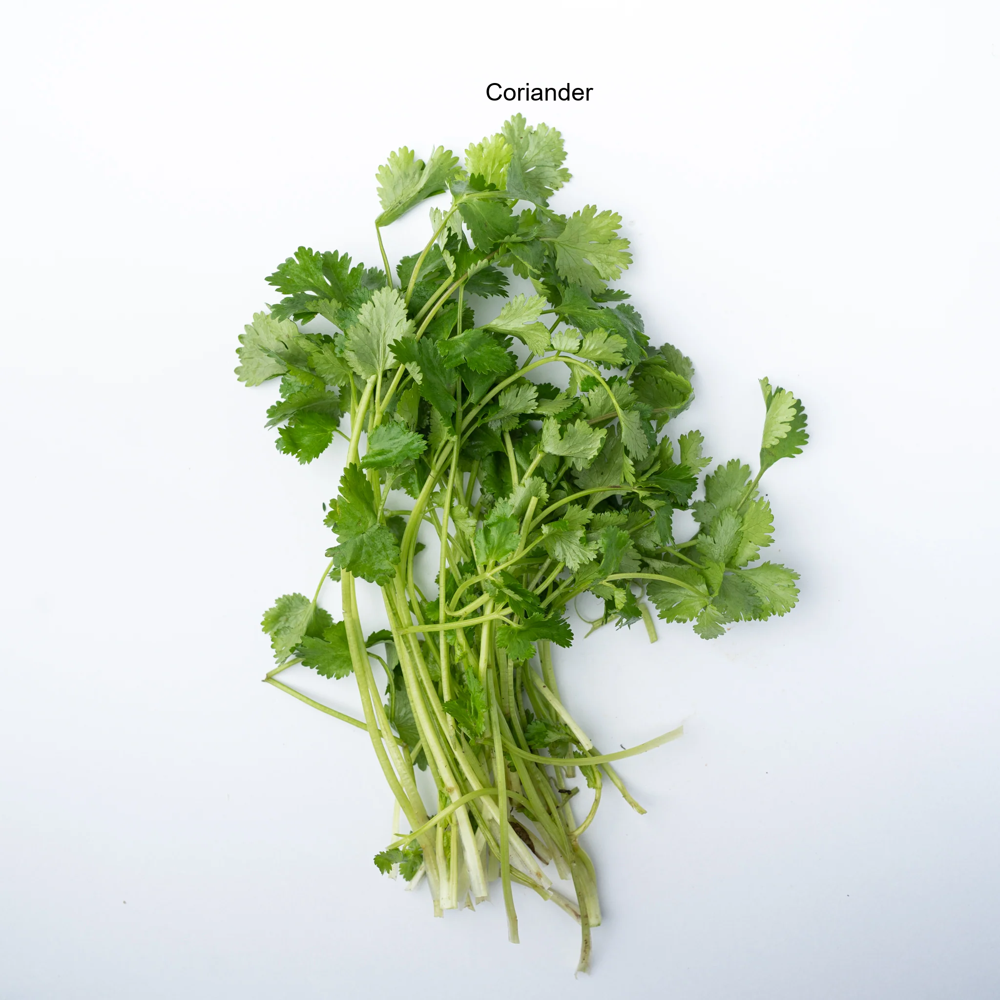
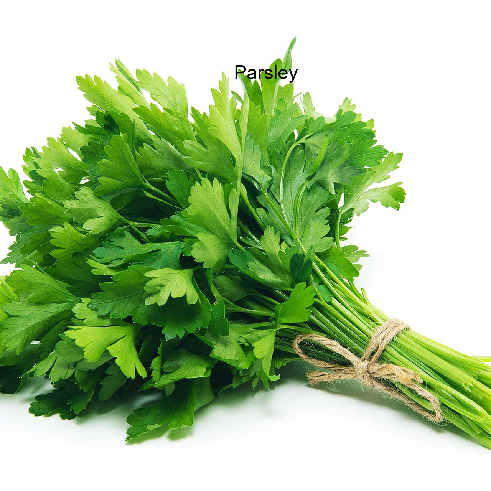

# Coriander vs Parsley: The Never-Ending Confusion

## Overview
This project aims to tackle a problem many of us face in real life: confusing coriander and parsley! Using the power of deep learning and computer vision, we created a model that can distinguish between the two with improved accuracy. The project includes a custom CNN architecture and a fine-tuned VGG16-based model to achieve this goal.

## Motivation
The idea for this project came from a real-life incident at home where the confusion between coriander and parsley caused culinary chaos. This led to the thought: "Why not solve this confusion with AI?" And so, this project was born.

---

## Table of Contents
- [Overview](#overview)
- [Motivation](#motivation)
- [Dataset](#dataset)
- [Data Augmentation](#data-augmentation)
- [Model Architectures](#model-architectures)
  - [Custom CNN](#custom-cnn)
  - [VGG16](#vgg16)
- [Training and Evaluation](#training-and-evaluation)
- [Results](#results)
- [Technologies Used](#technologies-used)
- [Installation](#installation)
- [Usage](#usage)
- [Future Work](#future-work)
- [Contributing](#contributing)
- [License](#license)

---

## Dataset
The dataset consists of images of coriander and parsley. These images were collected and preprocessed into a training and validation set.

### Directory Structure:
```
train/
├── coriander/
├── parsley/
```

### Dataset Details:
- **Number of Classes:** 2 (Coriander, Parsley)
- **Training Images:** 80% of total images
- **Validation Images:** 20% of total images
- **Image Size:** Resized to 150x150 pixels

---

## Data Augmentation
To increase the robustness of the model and prevent overfitting, data augmentation techniques were applied:
- Horizontal and vertical flips
- Random rotations
- Zooming

This helped create variations in the dataset and mimic real-world scenarios where coriander and parsley might appear in different orientations.

---

## Model Architectures

### Custom CNN
The first model was a simple Convolutional Neural Network (CNN) designed from scratch. It consisted of:
1. **Convolutional Layers:** Extract features from the images.
2. **MaxPooling Layers:** Down-sample the feature maps.
3. **Fully Connected Layers:** Perform classification.

```python
model = models.Sequential([
    layers.Conv2D(32, (3, 3), activation='relu', input_shape=(150, 150, 3)),
    layers.MaxPooling2D((2, 2)),

    layers.Conv2D(64, (3, 3), activation='relu'),
    layers.MaxPooling2D((2,2)),

    layers.Conv2D(128, (3, 3), activation='relu'),
    layers.MaxPooling2D((2, 2)),

    layers.Flatten(),
    layers.Dense(128, activation='relu'),
    layers.Dropout(0.4),
    layers.Dense(1, activation='sigmoid')
])
```

**Results:**
- Validation Accuracy: Low (around 38%)
- Validation Loss: Higher than expected due to overfitting and limited feature extraction capability.

### VGG16 (Transfer Learning)
Given the limitations of the custom CNN, a pre-trained VGG16 model was used for feature extraction. The model was fine-tuned for this binary classification task.

**Architecture Highlights:**
- Base VGG16 layers frozen to retain pre-trained weights.
- Custom dense layers added on top for classification.

**Results:**
- Validation Accuracy: Significantly higher than the custom CNN
- Validation Loss: Improved due to better generalization

---

## Training and Evaluation

### Training Process
- **Optimizer:** Adam
- **Loss Function:** Binary Crossentropy
- **Batch Size:** 4
- **Epochs:** 10

### Metrics Comparison
| Metric        | Custom CNN | VGG16        |
|---------------|------------|--------------|
| Validation Accuracy | Low    | ~70%         |
| Validation Loss     | High       | Low          |

### Observations:
- The VGG16 model outperformed the custom CNN due to its ability to extract advanced features.

---

## Results

### Sample Predictions




The model was tested on six sample images due to... let's say "time constraints." The predictions matched the labels for all six images.

---

## Technologies Used
- **Programming Languages:** Python
- **Libraries & Frameworks:**
  - TensorFlow/Keras
  - NumPy
  - Matplotlib
- **Tools:**
  - VS Code
  - Git for version control

---

## Installation

1. Clone the repository:
```bash
git clone https://github.com/yourusername/Coriander-vs-Parsley.git
```

2. Navigate to the project directory:
```bash
cd Coriander-vs-Parsley
```

3. Install dependencies:
```bash
pip install -r requirements.txt
```

4. Run the training script:
```bash
python Model.py
```

---

## Usage

1. Place your test images in the `PredictTest/` directory.
2. Run the prediction script after modifying the input images paths :
```bash
python Predict.py
```

---

## Future Work
- Expand the dataset for better generalization.
- Deploy the model as a web application.
- Explore other pre-trained architectures like ResNet or Inception.

---

## Contributing
Contributions are welcome! Please fork the repository and submit a pull request with your proposed changes.

---

## License
This project is licensed under the MIT License. See the [LICENSE](LICENSE) file for details.
